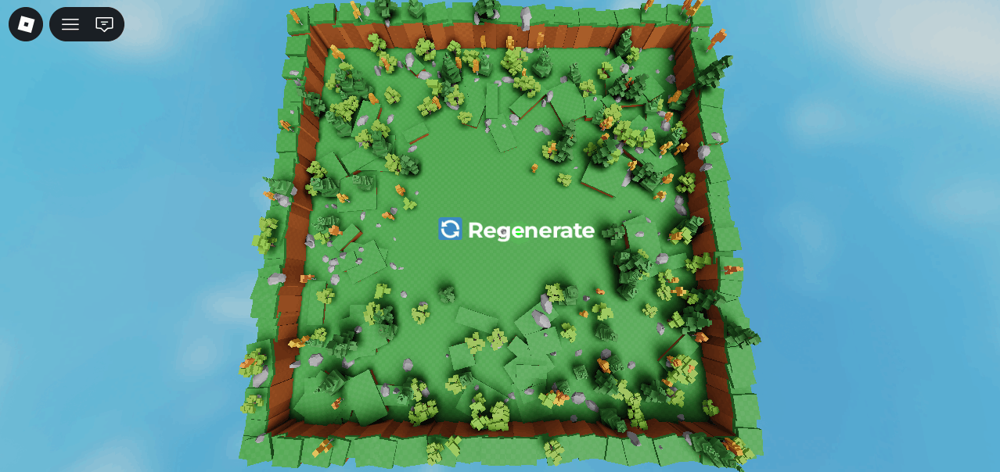

# 🌿 Terrain Generator

> A procedural map generator for Roblox — automatically creates natural-looking terrain with borders, scattered trees, and rocks.

---

## ⚙️ What It Does

Generates a complete map on run — no manual placement needed.

- 🗺️ **Border** — Clean boundary defining the map edges
- 🌄 **Base Terrain** — Naturally varied ground layout
- 🌲 **Trees** — Procedurally scattered for an organic feel
- 🪨 **Rocks** — Randomly placed to break up the landscape

---

## 📸 Preview

| |
|---|
|  |
[Source code](Generator.server.luau)

---

## 🛠️ Built With

- **Roblox Studio**
- **Lua**

---
